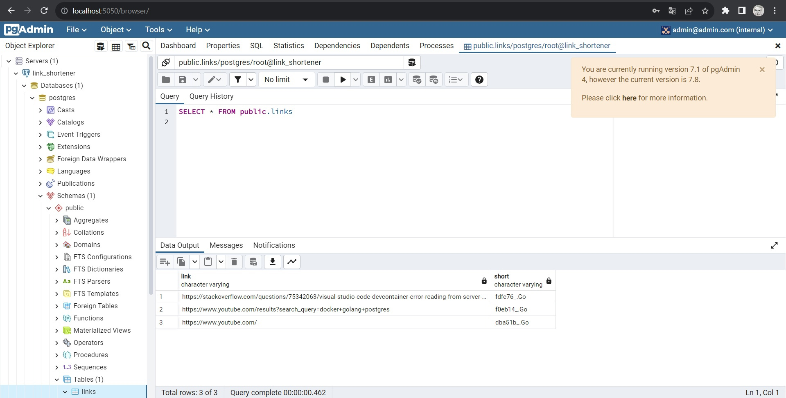
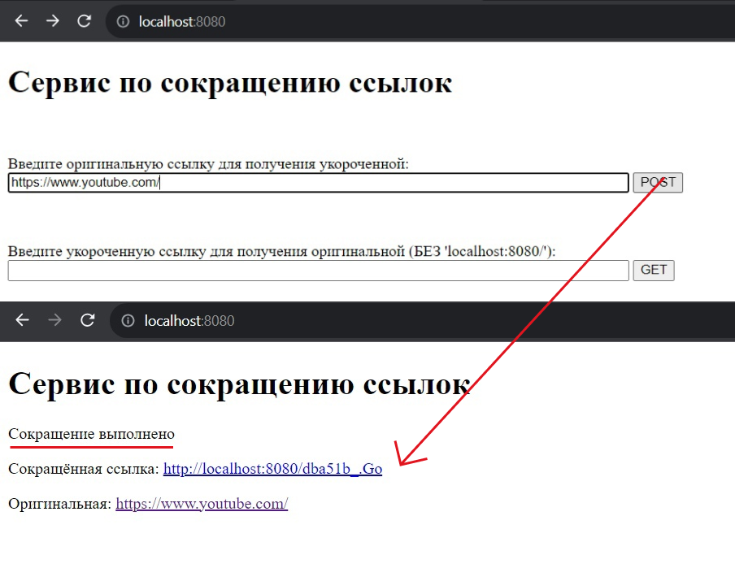
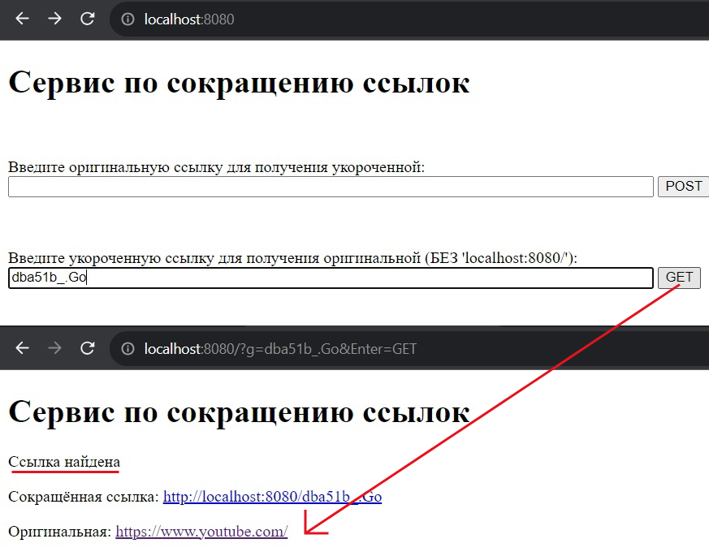
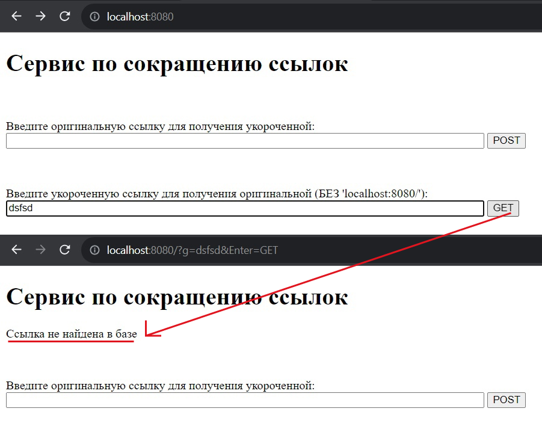
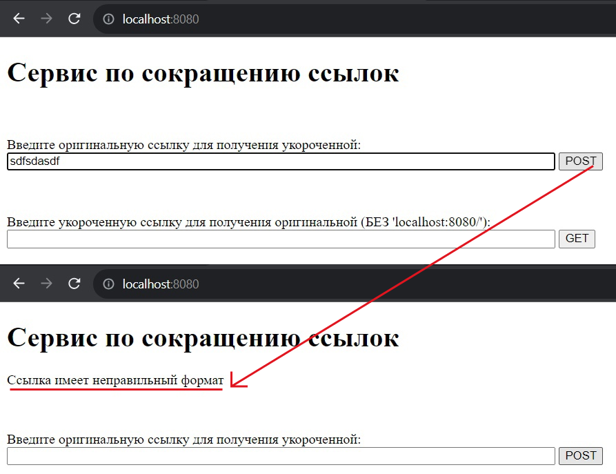

# gRPC сервис по созданию сокращённых ссылок
**Клиентская** часть расположена на **localhost:8080**, **серверная** на **localhost:9080**, **БД Postgres** на **db:5432**, **PgAdmin** на **localhost:5050**.
___
**Запуск проекта через docker-compose:** ```> docker-compose up```\
По умолчанию запустится с хранилищем **postgres**. Для того, чтобы запустить проект с **in-memory** хранилищем необходимо в файле *start_servers.sh* изменить значение флага *-storage* с **postgres** на **in-memory**.\
На моём персональном ПК обычно приходится ждать ~5 минут пока не подрузятся все образы.
___
**Запуск без докера:** (если установлены все приложения/утилиты)\
```> go run ./cmd/server/main.go -storage=postgres``` — сервер (тип хранилища postgres или in-memory)\
```> go run ./cmd/client/main.go``` — клиент
## Доступ в PgAdmin
**Логин**: admin@admin.com\
**Пароль**: root  

<u>Необходимо будет подключиться к БД:</u>\
**Host name\address**: db\
**Port**: 5432\
**Maintenance database**: postgres\
**Username**: root\
**Password**: rootroot  

После этого появится БД с таблицей *links*, в которой хранятся все оригиналы и их сокращения:  



## Примеры работы
POST запрос на сокращение


GET запрос на получение оригинала (переадресация тоже есть)


Сокращенной ссылки нет в базе


Ссылка имеет неверный формат
